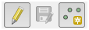

.. Pic2Map documentation master file, created by
   sphinx-quickstart on Sun Feb 12 17:11:03 2012.
   You can adapt this file completely to your liking, but it should at least
   contain the root `toctree` directive.

Welcome to Pic2Map's documentation!
===============================================

.. toctree::
   :maxdepth: 2
   
This plugin has been developed during  Gillian Milani's master thesis at EPFL in the `lASIG laboratory <http://lasig.epfl.ch/>`_. The plugin development is based on the following work: Timothée Produit and Devis Tuia. An open tool to register landscape oblique images and generate their synthetic models. In Open Source Geospatial Research and Education Symposium (OGRS), 2012. 

The plugin is still in its developement phasis and you can send your comments with us: gillian.milani at epfl.ch

.. image:: images/epfl_logo.png
   :width: 200 px

Already aware of the plugin ? Go to the :ref:`tricks` section !

.. index:: Concepts

Concepts
=================

Pic2Map allows you to do usual GIS works directly from a landscape picture. 
In essence, the plugin brings the capability to work with a perspective view 
instead of the usual orthogonal view. For achieving this goal, the position, the orientation, as well as internal 
parameters of the camera need to be determined from ground control points (GCPs). This allows interaction between the picture 
and the Digital Elevation Model (DEM). 

.. image:: images/oblique2.png
   :width: 300 px
   :align: center
   
The Pic2Map plugin brings more than new capabilities in QGIS, it brings also new people! 
Consider using this tool if your deal with one of the following situations:

* Creation of raster with oblique photography
* Determination of camera position
* Rapid mapping after disaster such as avalanche or landslide
* Recursive mapping, such as map of snow melting or traffic jams
* Mapping from terrestrial images
* Change detection from terrestrial images
* Augmented reality in landscape picture

   
The steps to use Pic2Map are the following:

#. Load a landscape picture with a corresponding DEM
#. Determine the pose of the camera by GCP or navigation in virtual view
#. Use the monoplotter for standard GIS works on oblique picture

.. index:: Installation

Installation and testing dataset
======================

You can download the plugin from the following repository: https://documents.epfl.ch/groups/l/la/lasig-unit/www/pic2map/lasigRepository.xml

For adding a the new repository to qgis, go to :menuselection:`Plugins --> Manage ans install plugins... --> settings Tab --> Add...` and add the repository url. Then, you can enable the plugin by searching the plugin list.

A technical introduction video can be found `here <https://www.youtube.com/watch?v=3Wic6PYUaKU>`_ .The original plugin folder contains a data set for testing the plugin. Extract the data outside the original folder (for example on the desktop) for being able to use them.

.. index:: System requirement

System requirement
======================

QGIS 2.2 is required

You need the 32-bits version of QGIS for running the plugin ! (because of pyopengl...)

Currently, the plugin has been used without obstacles on following configuration:
Window 7, Intel Core 2 Duo 2.5 GHz, 4 GB RAM, GPU nvidia 8700 GT (512 MB)
Window XP SP3, Intel Core 2 Duo 2.2 GHz, 2 GB RAM, GPU nvidia Quadro NVS 135M (without support of Framebuffer)
virtual machine Ubuntu 14.04 LTS, 4 GB RAM
 
OpenGL 3.0 is required for Framebuffer support. If Framebuffer is not supported, some tool capabilities are restricted.

You may have problem with Opengl.GL under Ubuntu. In this case, use the following commands and try again:

* sudo easy_install pyopengl
* sudo apt-get install python python-opengl python-qt4 python-qt4-gl

.. index:: Data requirement

Data requirement
======================

For using this plugin, you will need:

* An oblique picture (png, jpeg, etc.)
* A DEM in tiff format 
* Incidentally an orthoimage 

The DEM has to be consistent with the picture.
It means that you can only work with parts of your picture corresponding to the DEM area.
The terrain 3D is not generated from the picture. You have to know it before.
The speed of the plugin depends on the size of DEM, so try to balance between performance and quality.
Tif files with 1000 x 1000 pixels can be considered as a limit for a comfortable work. 
It corresponds to a square of 30km width with ASTER Dem, which is much more than needed.

.. index:: DEM
.. index:: How to get DEM

If you don’t have a DEM, follow these steps:

#. Go on http://earthexplorer.usgs.gov/ and download a tile of ASTER or SRTM
#. Check which UTM zone you need on `wikipedia <http://upload.wikimedia.org/wikipedia/commons/e/ed/Utm-zones.jpg>`_
#. Use the tool :menuselection:`Raster --> Projections --> Warp` and reproject it from WGS84 (EPSG:4326) the to the ETRS89 / UTM spatial reference system.
#. Use the tool :menuselection:`Raster --> Extraction --> Clipper` for taking only the area that you need. 
#. Incidentally use the tool :menuselection:`Raster --> Conversion --> Translate` for rescaling your DEM or ortho-image

.. index:: Initialization

Initialization
======================

Required data are a landscape picture and a DEM. You can optionally give an orthoimage. 
The orthoimage must have the same SRS, even if they don't need to superimpose exactly.
If you choose to use an ortho-image, the 3D view will appears black outside the bounding box of the orthoimage. 
If you prefer working with shaded DEM, don’t use ortho-image. 
Moreover, your orthoimage must not be heavier than few Mb.
After loading the data, **check that the Project SRS is the same as your DEM projection system**. 
If not or if you’re not sure, right click on the DEM layer and set the project SRS with DEM SRS. 
After adding layers from the openLayers plugin, you have to reset the project SRS from the DEM.

.. image:: images/setProject.png
   :width: 300 px
   
.. index:: Pose estimation

Pose estimation
======================

The pose includes the orientation and position of the camera. 
Moreover, the focal need to be estimated. The central point is fixed to the center of the picture.
These two last are internal camera parameters. 
There are two approaches for the pose estimation. 
Either you recognize some features present in the picture and in the canvas which are the GCPs,
either you opt for a more “gaming” approach, called here Virtual 3D.  

.. _my_drawn_table_1:

+--------------+--------------------------------------------------+-----------------------------------------------------+
|              | GCP Approach                                     |   Virtual 3D Approach                               |
+--------------+--------------------------------------------------+-----------------------------------------------------+
|              |Some known parameter can be fixed                 |   An acceptable estimation can be achieved rapidly  |
|              |                                                  |                                                     |
|Advantages    |The result is best mathematically rigorous        |   The method is simple and clear for everyone       |       
|              |                                                  |                                                     |
|              |The focal is usually well estimated               |   The horizon line can be precisely  adjusted       |
+--------------+--------------------------------------------------+-----------------------------------------------------+
|              |Precision is related to the number of GCP         |   Pose estimate usually is not accurate             |
|              |                                                  |                                                     |
|Disadvantages |Precision is related to the quality of GCP        |   The focal is not easily determined                |
|              |                                                  |                                                     |
|              |Digitalization of GCP is time consuming           |   We do not have directly a measure of the precision|
+--------------+--------------------------------------------------+-----------------------------------------------------+

It is possible to mix both approaches:

* Start with virtual 3D approach and save the pose in KML
* Restart with GCP approach, load the KML pose
* Use the 3D view at the current pose for GCP digitalization

.. index:: GCP approach

GCP approach
------------------
The standard way of pose estimation is to 2D-3D correspondences detected in the picture and on the DEM.
The correspondences exist here as point features and are called Ground Control Point (GCP). 
Each GCP helps to gain precision for the pose estimation.
A minimum of 6 points are required for solving the problem. 
However, it is recommended to use more than 6 GCPs, at the very least 10. 
We recommend using the 3D viewer, which ease the recognition of GCPs, instead of the Qgis Canvas.

.. image:: images/GCP.png
   :width: 300 px
   :align: center
   
We make use standards algorithm in computer vision for estimation of the pose.
Points in the picture have to be linked to coordinates in world (or local) coordinate system.
Direct Linear Transform (DLT) algorithm is used for estimation of the position.
Several parameters can be fixed trough a least square refinement of the DLT.

The GCP digitalization interface is divided in five main areas:

#.	The scene
#.	The GCP table
#.	The GCP toolbar
#.	The scene toolbar
#.	The 3D toolbar

.. image:: images/GCPApproach.png
   :width: 600 px
   :align: center
   
.. index:: Scene
   
The Scene
^^^^^^^^^^^^

It’s basically a view of the picture.
You select a GCP in the table and then click on the scene for getting the picture coordinates. 
The scene toolbar (4) helps you to navigate inside the picture and the canvas. 

.. index:: GCP table

The GCP table
^^^^^^^^^^^^^^

The two first columns are the 2D picture coordinates. 
The three following are the world coordinates (East, Nord and altitude). 
To fill the table, select a line and click on the scene to get image coordinates. Click on its correspondence in the QGis canvas for the world coordinates.
There is also a ways to get 3D coordinates from the 3D viewer by :kbd:`ctrl + Left Click`: . In fact, this last option is recommended 

The fifth one is a column of GCP state. You can disable the GCP for the pose estimation. 
A projection will be done, even if it’s not used by the algorithm. In the last column, you have an indication of error. 
It is exactly the 3D distance between the world coordinate and the reprojection of picture GCP. 

.. |toolbar1| image:: images/toolbar1.png
               :width: 2 em
.. |toolbar2| image:: images/toolbar2.png
               :width: 2 em
.. |toolbar3| image:: images/toolbar3.png
               :width: 2 em
.. |toolbar4| image:: images/toolbar4.png
               :width: 2 em
.. |toolbar5| image:: images/toolbar5.png
               :width: 2 em
.. |toolbar6| image:: images/toolbar6.png
               :width: 2 em
.. |toolbar7| image:: images/toolbar7.png
               :width: 2 em
.. |toolbar8| image:: images/toolbar8.png
               :width: 2 em
.. |toolbar9| image:: images/toolbar9.png
               :width: 2 em
.. |toolbar10| image:: images/toolbar10.png
               :width: 2 em
.. |toolbar11| image:: images/toolbar11.png
               :width: 2 em
.. |toolbar12| image:: images/toolbar12.png
               :width: 2 em
.. |toolbar13| image:: images/toolbar13.png
               :width: 2 em
.. |toolbar14| image:: images/toolbar14.png
               :width: 2 em
.. |toolbar15| image:: images/toolbar15.png
               :width: 2 em
.. |toolbar16| image:: images/toolbar16.png
               :width: 2 em

			   
.. index:: toolbar GCP

The GCP Toolbar
^^^^^^^^^^^^^^^^

|toolbar1|  Create a new line in the GCP table

|toolbar2|  Delete the selected line in the GCP table

|toolbar3|  Save the GCP table

|toolbar4|  Load a GCP table

|toolbar13|  Remove the reprojected GCPs after a pose estimation

|toolbar8|  Change display setting of GCPs

.. index:: toolbar scene
  
The scene toolbar
^^^^^^^^^^^^^^^^^^

|toolbar5|  Zoom in the scene

|toolbar6|  Zoom out the scene

|toolbar7|  Toogle the Pan tool for the scene

|toolbar12|  Zoom on the selected GCP in the scene and in the canvas

.. index:: toolbar 3D
  
The 3D toolbar
^^^^^^^^^^^^^^^^

|toolbar9|  Open the pose estimation dialog box

|toolbar10|  Open the 3D viewer. 

|toolbar11|  Close the GCP digitalization window and open the monoplotter

|toolbar14|  Show information contain in EXIF

|toolbar16|  Save current pose estimation in KML file

|toolbar15|  Load a pose estimation from KML file

Information about the motion in 3D viewer:

*	:kbd:`Left mouse button pressed`: move left-right an up-down
*	:kbd:`Right mouse button pressed`; rotate on the tilt and azimuth
*	:kbd:`Wheel`: go front and back (Press wheel for a finer placement)

Information about the capabilites in 3D viewer:

*	:kbd:`ctrl + Left Click`: get 3D coordinates for selected GCP
*	:kbd:`alt + Left Click`: fix the position of the camera on the DEM at the clicked position

.. index:: Virtual 3D

Virtual 3D approach
---------------------

We make use of the ability of users to estimate position, orientation as well as the focal of the camera by navigating in the virtual landscape.
The pose estimation is done empirically. 
The camera travel in the world until the precision of the calking is enough for application purposes. 
You can save the pose estimation in KML file and open it directly on google earth. 
It's also possible to load pose of picture from google earth. 

.. figure:: images/virtual3D.png
   :width: 600 px
   :align: center
   
.. index:: Monoplotter

Monoplotter
============
Once the pose is set, you can start to do usual GIS work with your picture. 
Don’t forget that the correspondence is done by using the DEM. 
So if you have bad quality DEM or bad pose estimation, the correspondence will be affected.
It is currently possible to work on points and polylines. 
Polygons have not been yet integrated in the plugin for various reasons. 

.. index:: Augmented Reality

Visualization of layers
--------------------------

.. image:: images/visualisation.png
   :width: 600 px
   :align: center

For visualizing layers in your picture, just add them to the canvas and press “refresh layers”.
The symbology will be the same as the one used in the canvas. 
You can project simple, categorized or graduated symbology. 
However, you cannot use complex symbology, like point represented by stars or double lines representations.
Labels present in the canvas will be also drawn in the monoplotter. 
In this case, the font is not taken from the canvas.
You can press on “label settings” for controlling label appearance. 

.. index:: New features
.. index:: Digitalization

Digitalization
---------------

The synergy with the canvas is quite well done. 
For digitalizing a new feature, make sure that the layer is in editing mode and the “new feature” button is toggled. 

   
Then you can use :kbd:`ctrl + Left Click` on the monoplotter and digitize new features. 
The precision of digitalization will depend on the quality of the DEM and on the quality of the pose estimation.

.. index:: Measurements

Measurements
---------------

There are two different tools for measuring. The "Measure on plane" button opens the standard QGIS measure tool and allow its use in the monoplotter.
The second "Measure 3D" button opens an independent which act directly on the DEM.

*Measure on plane*
You can measure in the monoplotter as you would measure on the canvas by :kbd:`ctrl + Left Click`.
The measurements are done as if you would click from in the canvas at the projected location. 
It means that the measurement is done on the ellipsoidal. 
As explain in the technical documentation, the precision are related to the current canvas extent.
So if the precision is not sufficient, a better zoom has to be set in the canvas.

.. image:: images/mesurement.png
   :width: 800 px
   :align: center
   
*Measure 3D*   
If you want to take into account the altitude, you can opt for the 3D measurement tool.
With the 3D measurement tool, measures are done directly with the 3D coordinates from the DEM.

.. index:: Draping

Ortho rectification (Draping)
-------------------------------

By draping is understood the coloring of each DEM profil with the picture data. 
The process is quite similar to a standard ortho rectification for a satellite image.
A difference would be the need of a DEM in the current case instead of many images in photogrammetry.  
For getting a georeferenced raster from your picture, just click on “Drape on DEM”, and then choose an area on the preview window. 
Pull the mouse from up-left to the down-right direction. The pixel size can also be set. Some problems can arise if the resolution is too small. 
Keep well designed value, in order of the resolution of your DEM.

.. image:: images/drapingSave2.png
   :width: 800 px
   :align: center

You can save the raster in two format. Either in png, which will create an standard image, displayable from every image software. Either
you create a tiff raster, which will be geo-referenced and that you can open with your favorite GIS software.
The forth band of the geotiff raster can be used as transparency band. 
   
The process used for draping the DEM provide high quality results. 
It uses the best OpenGL features for texturing
heightmap with every detail of the picture.
If you are interested in the detail of the draping, you can consult documentation of openGL about texturing.

.. _tricks:

Tricks for a comfortable experience
=====================================

* Don't forget to work always with the SRS of your DEM!

*About the DEM, orthoimage and picture*:

* If you're not used to GIS world, get some help for getting a nice DEM. The four point in "Data requirement" can look simple, but troubles come pretty fast.
* Don't use a DEM with more than 1'000'000 pixels if high rate calculations are needed.
* If you can get a better DEM than Aster or SRTM; don't hesitate, it's worth in most cases.
* The plugin will tend to crash if you use large images (> 10Mb). This is due to limitation on GPU for buffering (generally in scale of the screen wide)
* If you have to use a large DEM, use an orthoimage if the initial loading is too slow. This last step would be skipped (calculation of shadow of DEM)

*About the pose estimation*:

* For getting GCP in world coordinates, try to use the 3D viewer first, it is much easier than on the orthogonal view.
* Try to get GCP in every part of the picture. Then you can refine them by using OpenLayers plugin for example.
* The best configuration for the GCPs is a cube. Don't hesitate to put GCP at the bottom of mountain, not only at the top.
* If you have no idea where the picture has been taking, just wait 1 or 2 years, we will find a solution...
* If you still have no idea where the picture has been taking, but really want to use Pic2Map, you can navigate in virtual globe (WorldWind for example) to find it !
* Check the pose estimation by opening the 3D viewer. It gets initialized at the current pose estimate when opened.
* Below are presented particular cases of reprojection of GCP. It is usual to fall in one of these cases.

.. _my_drawn_table_2:

+--------------+--------------------------------------------------+-----------------------------------------------------+
|Description   |Most GCP are reprojected near the camera position |   Reprojection fall too far from the GCP            |
+--------------+--------------------------------------------------+-----------------------------------------------------+
|Image         |.. image:: images/behindMountain.png              |.. image:: images/reprojectOnOtherMoutains.png       |
|              |   :height: 200 px                                |   :height: 200 px                                   |       
+--------------+--------------------------------------------------+-----------------------------------------------------+
|              |You position fall behind a mountain.              |It's not a problem if the GCPs are on top on Hill    |
|              |Fix your position with :kbd:`Alt + Left Click`:   |There are just reprojected few meters above the top. |
|Solution      |in 3D view                                        |Change also GCP in canvas if you change them in      |
|              |                                                  |picture                                              |
+--------------+--------------------------------------------------+-----------------------------------------------------+

*About the monoplotter*:

* Depending on the number of layer in the canvas, the refreshment of the monoplotter can take some times. You will not have any problems if the features are away from your DEM (they become clipped as well as features behind the camera).
* Polygons are not yet supported by the monoplotter. It may comes in few months...
* Don't try to use complex symbology.
* During the draping, don't choose a too small resolution. It may not be supported if the ratio - (#pixels in DEM * DEM resolution) / resolution of orthoimage - is too high.
* The measure tool doesn't measure in the picture directly. It projects the click of the mouse in the canvas. So the measure is, in reality, done in the canvas. This implies a strange behavior: if you want to do precise measurement in the picture, you have to zoom at the right place in the canvas.
* The same as previous point is worth for digitalization of new features. 
   
.. index:: Technical documentation

Technical documentation
=========================
A more detailed documentation with equations can be asked to gillian.milani@epfl.ch

Pose estimation
-----------------
In this section will be presented the algorithms used for the pose estimation using GCP. In brief, the Direct Linear Transform (DLT) algorithm is used
for the initial guess of the pose. Then a least square algorithm is used for the purpose of fixing known parameters and refining.

The DLT algorithm give H, the homographic projection in U = H * X where U is a pixel coordinates, X a coordinates in 3D space. The first challenge is therefore to implement
the DLT, which is not so hard. Then, a more complex question is to get the projections parameters from H. The rotation matrix is not trivial to extract.
The position is also related to the rotation estimates. The extraction of the rotation matrix can change radically with few changed in GCP positions. 
A first estimate of rotation matrix is extracted according to the DLT equations. 
Then a cholesky factorization is applied in order to shape the estimate in a real rotation matrix

According to the co-linearity equation, parameters are the position (x,y,z), the orientation (t,h,s) the focal (f) and the central point (u0, v0).
For the work with openGL, it was sensefull to fix the u0 and v0 at 0. This is the reason of applying the least square algorithm even when the user doesn't fix some parameters.
Or in other words, the central point is always fixed to zero after the DLT calculation.

The least square variant implemented is the algorithm of Levenberg-Marquardt. With such an implementation, we raise the stability of the least square approach,
which is very unstable in our case due to the high non-linearity of the co-linearity equation. On the other hands, we keep high performances compared to a 
standard gradient approach since some parameters, as the rotation, can change quite a lot between the first DLT estimate and the least square results.

QGis Interactions
------------------

Under the principal of extension, a plugin has to reuse as much as possible tools already available in the software. 
The available modules of QGis have been mainly helpful in the case of layers visualization and layer digitalization.

In the first case, a loop crosses all symbology layers and store information about width, color, categories and graduation.
Then a second loop crosses the layer and tests if a feature is visible or not. If it is visible, it keeps trace of the symbology in an index array.
In the painting loop, each feature is drawn according to the geometry stored in an array and the symbology is selected according to the index array. 

When a new feature is created in the picture, the feature is not directly created according to the projection.
A virtual click is created on the canvas at the projected coordinates. With such a virtual click, it is guaranteed  to get the same behavior as if the click would be
done directly on the canvas.

The measure tool is currently affected by some implementation  difficulties. 

OpenGL Integration
------------------

OpenGL is the central trunk of the plugin. Here are some explanations about what happens in reality in the monoplotter. 
It will be clear as spring water if you have already used the 3D approach for pose estimation.

In the monoplotter, the picture is drawn in the background. Then the DEM is created exactly as in the 3D viewer. The camera is initialized  at the previous pose estimate.
Finally the DEM is set as completely transparent. 
So when you digitalize new features or do some measurements, you think you're clicking on the picture, but in fact, you're clicking on the DEM which is transparent in front of the picture!

If you are interested in the creating of 3D view with DEM, the code is open source and you can enjoy it. If you find the code harsh to read, you can send me an email.

The first progress bar, after the initialization, taks time for normal calculation, in case you don't have an orthoimage. 
We need to calculate the normals for the purposes of shading the DEM. We could use a standard tool of qgis (gdal) for shaded DEM, But knowing the focal
allows to enable lightning in opengl. The shadows move therefore with the camera, which ensure a good enlightenment  wherever is the pose estimate.

Draping
--------

In brief, you give a picture coordinates at each DEM Vertex. 
The DEM triangles formed by three vertices is filled with a stretched image given the coordinates of the vertex. 
So it is possible to get a better color resolution than the DEM resolution. 

.. image:: images/draping.png
   :width: 400 px
   :align: center